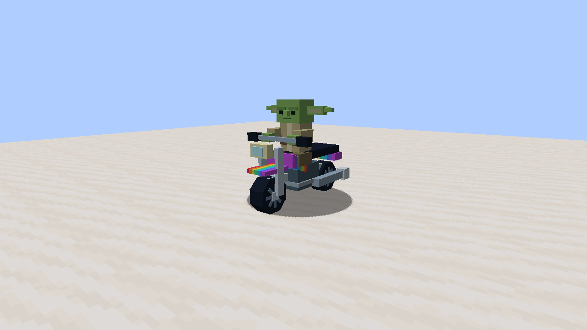

# Zion’s Minecraft Builder

Build imaginative Minecraft creations with Hermes, GLM5.3 Flash, generated inventory
art, durable jobs and evidence checks. Targets **Minecraft Java1.21.4, Forge54.1.0
and Java21**. Existing worlds and legacy mod IDs are preserved.

## Rainbow motorcycle and showcase

The included `mods/zion-supercharge` project provides `zion_builder` and `zion_showcase`:

- A rainbow motorcycle with a modeled Yoda driver and a rear seat for the player.
  W drives, S brakes, A/D steer, Space+W activates turbo, Shift dismounts.
  Turbo targets1,000mph; actual speed is displayed. Swept collision checks and
  unloaded-terrain checks stop the motorcycle safely.
- A shiny sword with transparent inventory artwork and a held model.
- Fridge storage, book storage, cooking appliances, seats and bathroom fixtures
  with recognizable geometry and usable interactions.
- Bedroom, kitchen, bathroom, sitting room, chill room and house presets with
  protected placement, persistent progress and an undo journal.

Try `/zion spawn rainbow_motorcycle`, `/zion give shiny_sword`, `/zion list` or
`/zion preview kitchen` in the game. Mutation commands require operator permission.
`/zion place kitchen` checks the space before building; `/zion find` shows progress;
`/zion undo` preserves player changes and refuses to discard stored items.
`/zion keep` keeps a finished build and clears its undo record so another can begin.

## Builder workflow

Telegram and the local browser share `tools/zion_jobs.py`. Requests, attempts,
generated files, errors and cancellation survive a UI restart. A failed provider
process is a failed build; unfinished verification is shown explicitly.

The coding adapter invokes the installed Hermes agent with
`z-ai/glm-5.3-flash` through OpenRouter. `tools/zion_art.py` uses the dedicated image
endpoint, validates alpha and produces64×64 inventory PNGs. Furniture can also use
its detailed3D block model as its inventory icon.

Every creation has a versioned manifest containing capabilities, resource IDs,
assets, commands, artifacts and verification evidence. The validator decodes PNGs,
resolves resource references, checks packaged bytes and binds test reports to JAR
hashes. Minecraft1.21.4 item definitions and resource/data formats46/61 are enforced.

Jev reviews request coverage and evidence through the approved shared gateway.
Its result is advisory: supported, contradicted, insufficient or unavailable.
It cannot replace compiling, joining the server, rendering or testing gameplay.

## Installation and development

Install Python dependencies from `requirements-builder.txt`. The shared runner
uses Hermes from PATH or `HERMES_EXECUTABLE`. Keep credentials in private runtime
configuration. Install the three repository skills with `tools/install_hermes_skills.py`;
the installer preserves existing learned skills and detects conflicting names.

The Forge project and template contain the official Gradle8.8 wrapper. Build the
showcase with `./gradlew build` inside `mods/zion-supercharge`. Run the real game
tests with `./gradlew -PzionGameTests runGameTestServer`. Development tests and the
opt-in graphical harness are excluded from release JARs.

Run `python -m unittest discover -s tests -v` and `python tests/test_smoke.py` for
builder/deployment regression checks. CI also compiles the pinned Forge project.

Deployment is an explicit validated step. The deployer backs up exact artifacts and
the stopped world/configuration, identifies the affected client and server, installs
matching bytes, checks fresh startup and recovers a failed installation. It never
clears a world lock or kills unrelated Java processes.

See [the approved plan](docs/supercharge-plan.md),
[builder operations](docs/builder-operations.md),
[deployment and recovery](docs/deployment.md),
[provider test evidence](verification/provider-checks.json), and
[gameplay evidence](mods/zion-supercharge/verification/build-and-gameplay.json).
